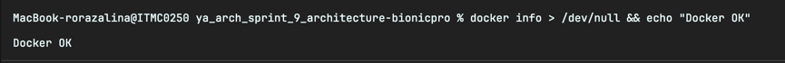
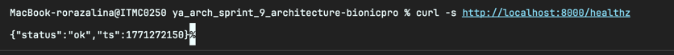
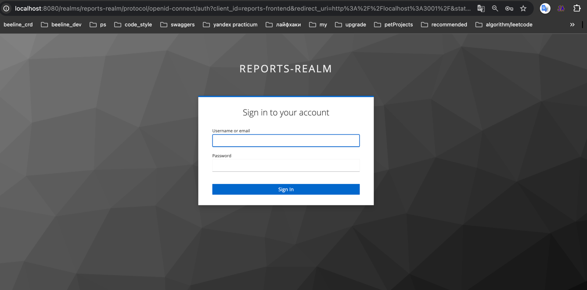
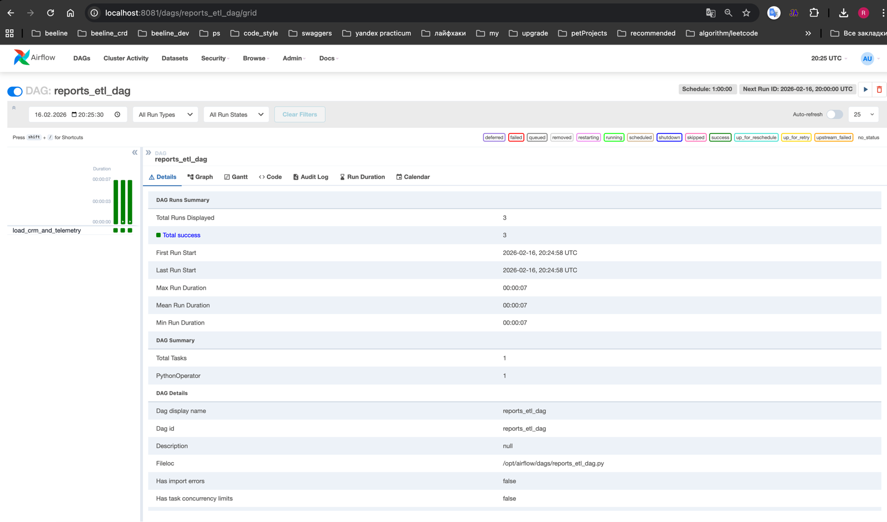
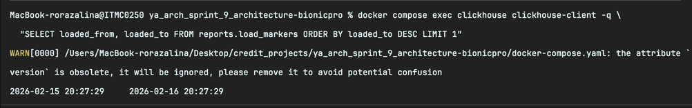
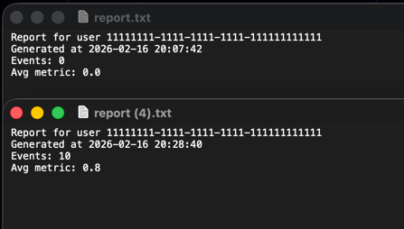

# BionicPRO
---

Коротко: компания производит бионические протезы и собирает телеметрию для улучшения ML-модели.  
Цель проекта: безопасность через PKCE и выдача отчетов из OLAP по запросу пользователя с доступом только к своим данным.

## Технологии
* OAuth 2.0
* Docker и Docker Compose
* React + TypeScript + TailwindCSS
* Keycloak PKCE S256
* FastAPI Python 3.11
* ClickHouse OLAP
* Apache Airflow DAG для ETL
* Draw.io для C4

## Ветки
* `main` — целевая
* `sprint_9` — для работы

## Документация
* Диаграмма C4: [docs/Task 1/BionicPRO_C4_model.drawio_Task_1.xml](docs/Task 1/BionicPRO_C4_model.drawio_Task_1.xml)

## Что внутри
---
* PKCE во фронтенде и настройка клиента в Keycloak
* Сервис отчетов на FastAPI (`/reports`) с проверкой JWT по JWKS Keycloak
* OLAP ClickHouse с простой витриной `user_reports`
* ETL в Airflow: объединение источников и запись маркеров загрузки `load_markers`
* UI с выбором периода и скачиванием отчета `report.txt`

## Структура проекта
---
```
.
├─ backend
│  ├─ app
│  │  └─ main.py
│  └─ requirements.txt
├─ frontend
│  └─ src
│     ├─ App.tsx
│     └─ components
│        └─ ReportPage.tsx
├─ keycloak
│  └─ realm-export.json
├─ airflow
│  ├─ Dockerfile
│  └─ dags
│     └─ reports_etl_dag.py
├─ docs
│  ├─ Task1
│  │   └─ BionicPRO_C4_model.drawio_Task_1.xml
│  └─ Task2
│      └─ BionicPRO_C4_model.drawio.xml
├─ docker-compose.yaml
├─ docker-compose.linux.yaml
├─ start.sh
├─ stop.sh
└─ init-clickhouse.sh
```

## Быстрый старт
---

### Подготовка Windows
* Установи Docker Desktop
* Установи Python 3.11 и pip

### Подготовка Linux
* Установи Docker и Docker Compose
* Установи Python 3.11 и pip

### Запуск всего стенда
```bash
./start.sh
```

### Остановка проекта
```bash
./stop.sh
# или
docker compose down
```


### Проверка сервисов
```
Frontend   http://localhost:3001
Backend    http://localhost:8000/healthz
Keycloak   http://localhost:8080
Airflow    http://localhost:8081
```
* Keycloak Admin Console: `http://localhost:8080/admin` (логин `admin`, пароль `admin`)
* Airflow UI: `http://localhost:8081` (логин `admin`, пароль `admin`)

## Локальная проверка (пошагово)
---
1. Проверь, что Docker запущен:
   `docker info > /dev/null && echo "Docker OK"`
2. Пересоздай Keycloak (обязательно после правок realm):
   `docker compose down -v`
3. Подними стенд:
   `./start.sh`
4. Проверь доступность Keycloak и backend:
   `curl -s http://localhost:8080 | head -n 1`
   `curl -s http://localhost:8000/healthz`
5. Если DAG на паузе, сними паузу:
   `docker compose exec airflow airflow dags unpause -y reports_etl_dag`
6. Запусти ETL:
   `docker compose exec airflow airflow dags trigger reports_etl_dag`
7. Уточни окно доступных дат:
   `docker compose exec clickhouse clickhouse-client -q "SELECT loaded_from, loaded_to FROM load_markers ORDER BY loaded_to DESC LIMIT 1"`
8. Открой UI `http://localhost:3001`, войди `user1/password123`, выбери даты из окна и скачай отчет.

### Скриншоты
* 
* 
* 
* 
* 
* 

### Логин в приложение
* Нажми **Login** во фронтенде
* Войди под пользователем `user1` с паролем `password123`
* Если Keycloak был инициализирован ранее, пересоздай БД Keycloak, чтобы подхватить обновленные роли: `docker compose down -v` и затем `./start.sh`
* Если при входе появляется экран `HTTPS required`, значит Keycloak импортировался со строгим SSL. Пересоздай Keycloak (команда выше) и убедись, что в `keycloak/realm-export.json` стоит `"sslRequired": "none"`. Также должен выполниться сервис `keycloak_init`, который отключает SSL‑requirement для realm `master`.

### Получение отчета
* Выбери период в пределах обработанного окна Airflow
* Нажми **Download Report**
* Скачается файл `report.txt`
* Если период вне обработанного окна, придет ответ `400` с подсказкой по допустимому окну
* Важно: данные в ClickHouse связаны с `sub` (UUID) из токена. Для демо фиксированные `sub` заданы в `keycloak/realm-export.json` и в env `USER1_SUB/USER2_SUB` сервиса Airflow (по умолчанию `11111111-1111-1111-1111-111111111111` и `22222222-2222-2222-2222-222222222222`). Если Keycloak уже был инициализирован раньше, пересоздай БД Keycloak: `docker compose down -v` и затем `./start.sh`, либо обнови `USER1_SUB/USER2_SUB` под фактические `sub` пользователя.
* Окно дат в `load_markers` — это последние 24 часа (ETL пишет `loaded_from = now - 1 day`, `loaded_to = now`), время хранится в UTC.

### Как запустить ETL в Airflow
* Открой Airflow по адресу из раздела выше
* Найди DAG `reports_etl_dag`
* Если DAG на паузе, сними паузу
* Запусти вручную либо дождись планового запуска

## Безопасность
---
* PKCE S256 во фронтенде и клиент Keycloak
* JWT проверяется по подписи и issuer, сервер берет JWKS из Keycloak
* Доступ к отчету только по своему `subject` из токена

### Переменные окружения
* Все значения заданы в `docker-compose.yaml`
* При необходимости можно создать файл `.env.example` и задокументировать собственные параметры

## Диаграммы
---
* [docs/Task 2/BionicPRO_C4_model.drawio.xml](docs/Task 2/BionicPRO_C4_model.drawio.xml)
